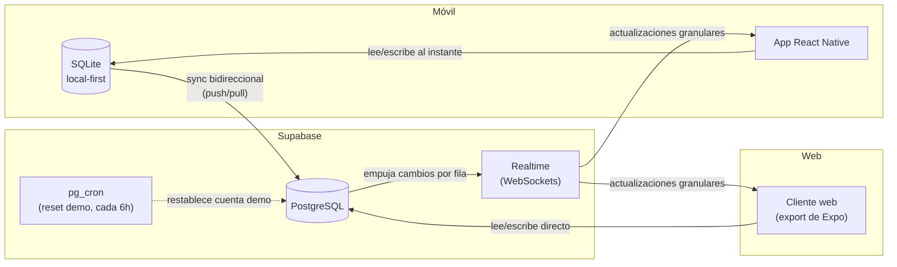

# Habit Tracker — tracker de progreso de estudio


Un **tracker de hábitos de estudio local-first** para libros, cursos y temas
que estás aprendiendo. Registra tu progreso diario en una rejilla mensual
tipo hoja de cálculo, revisa tus rachas y porcentaje de cumplimiento en un
dashboard, y mantén todo sincronizado entre tu celular y la web — incluso
sin conexión a internet.

Este es un proyecto personal construido de principio a fin (app móvil,
esquema de backend, motor de sincronización y despliegue) como pieza de
portafolio que demuestra arquitectura local-first, sincronización en tiempo
real, y desarrollo multiplataforma con React Native.

## Pruébalo

**Demo en vivo (web):** [habit-tracker-demo.vercel.app](https://habit-tracker-demo.vercel.app)

**Credenciales de acceso:**

| Correo | Contraseña |
|---|---|
| `demo@habittracker.app` | `Demo2026!` |

Algunas cosas que conviene saber antes de explorar:

- **Los datos de la demo se restablecen cada 6 horas**, mediante un job
  programado en Postgres (`pg_cron`). Cualquier tema o casilla que agregues
  o borres volverá a un estado de ejemplo limpio.
- **La cuenta demo tiene un límite** de temas activos, simplemente para que
  una demo pública compartida no crezca sin control.
- **Pruébala desde dos pestañas (o tu celular) a la vez** — palomea un día
  en un dispositivo y observa cómo se actualiza en el otro en menos de un
  segundo, vía Supabase Realtime.
- **El modo offline solo aplica a la app móvil**, no a esta demo web. El
  cliente web siempre habla directo con Supabase; la app móvil tiene una
  copia local completa en SQLite de tus datos y funciona sin ninguna
  conexión, sincronizando automáticamente al recuperar internet.

## Stack tecnológico

| Capa | Tecnología |
|---|---|
| Móvil / frontend | React Native + Expo (SDK 54), TypeScript |
| Navegación | Expo Router (basado en archivos) |
| Estilos | NativeWind (Tailwind CSS para React Native) |
| Base de datos local | SQLite (`expo-sqlite`) — solo móvil, fuente de verdad local-first |
| Backend | Supabase (PostgreSQL, Auth, Row Level Security) |
| Sincronización en tiempo real | Supabase Realtime (WebSockets) |
| Tareas programadas | `pg_cron` (restablecimiento automático de la demo) |
| Motor de sincronización | Bidireccional propio, resolución de conflictos last-write-wins |
| Gestor de paquetes | pnpm |
| Despliegue (web) | Vercel |
| Despliegue (móvil, planeado) | EAS (Expo Application Services) |

## Arquitectura



## Decisiones de arquitectura clave

- **Local-first en móvil, directo a la nube en web.** SQLite solo existe en
  el dispositivo, así que la capa de datos está dividida en archivos por
  plataforma (`.native.ts` / `.web.ts`) resueltos automáticamente por
  Metro, en vez de ramificar con checks de `Platform.OS` esparcidos por la
  lógica de negocio.
- **Resolución de conflictos: last-write-wins con protección de cambios
  pendientes**, no CRDTs ni un log de operaciones. Es una app de un solo
  usuario en unos pocos dispositivos personales — las ediciones
  concurrentes reales son raras y de bajo riesgo, así que la estrategia
  más simple es la correcta, siempre que una fila con cambios locales sin
  sincronizar nunca sea sobrescrita silenciosamente por un sync entrante.
- **Las actualizaciones en tiempo real parchan el estado de forma
  granular.** En vez de volver a pedir todo el conjunto de datos en cada
  evento de Realtime, cada evento actualiza solo la fila afectada en el
  estado local (con debounce para evitar ráfagas de re-render cuando
  cambian muchas filas a la vez).
- **Timestamps en UTC, fechas de calendario en hora local.** `updated_at`/
  `created_at` siempre están en UTC para comparaciones de sync correctas;
  la columna `day` (a qué día de calendario pertenece un hábito) se deriva
  de la hora local del usuario, porque "¿hice esto hoy?" lo responde el
  reloj del usuario, no el de Greenwich.

## Configuración local

### Prerrequisitos

- Node 18+ y [pnpm](https://pnpm.io/)
- Un proyecto de Supabase (el plan gratuito funciona)
- La app Expo Go en tu celular, o un emulador Android/iOS (opcional — el
  export web corre en cualquier lado)

### 1. Variables de entorno

```sh
cp .env.example .env
```

Completa la URL de tu proyecto de Supabase y la publishable (anon) key,
ambas disponibles en Project Settings → API dentro del dashboard de
Supabase.

### 2. Esquema de base de datos

El esquema completo (tablas, índices, políticas de Row Level Security y el
trigger de creación de perfil) vive en `supabase-setup/`. Corre
`001_schema_setup.sql` en el SQL Editor de tu proyecto de Supabase para
configurarlo. Es idempotente — seguro de ejecutar más de una vez.

### 3. Instalar y ejecutar

```sh
pnpm install
pnpm expo start
```

Presiona `w` para web, o escanea el código QR con Expo Go para móvil.

### 4. Cuenta demo (opcional)

Para recrear los datos de ejemplo y el horario de reinicio de la demo
pública, revisa `supabase-setup/002_seed_demo_data.sql` y
`supabase-setup/003_demo_limits_and_reset.sql`. Ambos requieren reemplazar
el UUID de ejemplo por un `auth.users.id` real.

## Limitaciones conocidas

Señaladas deliberadamente, no descubiertas después:

- **El cliente web no tiene soporte offline.** Lo local-first (SQLite) solo
  aplica a la app móvil. Es una decisión de alcance, no un error — una PWA
  web con base de datos offline es un esfuerzo considerablemente mayor que
  su equivalente móvil, y el uso offline en móvil era la prioridad de este
  proyecto.
- **La resolución de conflictos es last-write-wins**, no CRDTs
  eventualmente consistentes. Correcta y simple para un solo usuario en
  unos pocos dispositivos; habría que cambiarla si esto se volviera una
  herramienta colaborativa multiusuario.
- **Aún no hay notificaciones push ni recordatorios** — la app funciona por
  palomeo, no por notificación.