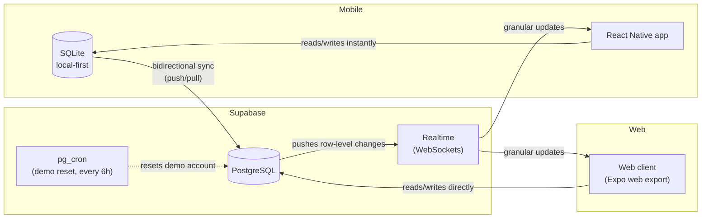

# Habit Tracker — study progress tracker


A **local-first study habit tracker** for books, courses, and topics you're
learning. Log your daily progress on a spreadsheet-style monthly grid, see
your streaks and completion rate on a dashboard, and keep everything in sync
across your phone and the web — even without an internet connection.

This is a personal project built end-to-end (mobile app, backend schema,
sync engine, and deployment) as a portfolio piece demonstrating local-first
architecture, real-time sync, and cross-platform React Native development.

## Try it

**Live demo (web):** [habit-tracker-demo.vercel.app](https://habit-tracker-alpha-ten-48.vercel.app/)

**Login credentials:**

| Email | Password |
|---|---|
| `demo@demo.com` | `demo2026` |

A few things to know before you click around:

- **Demo data resets every 6 hours**, via a scheduled Postgres job
  (`pg_cron`). Whatever topics or check-ins you add or delete will be wiped
  back to a clean sample state.
- **The demo account is capped** at a small number of active topics, purely
  to keep a shared public demo from growing unbounded.
- **Try it from two tabs (or your phone) at once** — check off a day on one
  device and watch it update on the other within a second, over Supabase
  Realtime.
- **Offline mode only applies to the mobile app**, not this web demo. The
  web client always talks to Supabase directly; the mobile app has a full
  local SQLite copy of your data and works with no connection at all,
  syncing automatically once you're back online.

## Tech stack

| Layer | Technology |
|---|---|
| Mobile / frontend | React Native + Expo (SDK 54), TypeScript |
| Navigation | Expo Router (file-based) |
| Styling | NativeWind (Tailwind CSS for React Native) |
| Local database | SQLite (`expo-sqlite`) — mobile only, local-first source of truth |
| Backend | Supabase (PostgreSQL, Auth, Row Level Security) |
| Real-time sync | Supabase Realtime (WebSockets) |
| Scheduled jobs | `pg_cron` (automatic demo data reset) |
| Sync engine | Custom bidirectional sync, last-write-wins conflict resolution |
| Package manager | pnpm |
| Deployment (web) | Vercel |
| Deployment (mobile, planned) | EAS (Expo Application Services) |

## Architecture



## Key architectural decisions

- **Local-first on mobile, direct-to-cloud on web.** SQLite only exists on
  the device, so the data layer is split into platform-specific files
  (`.native.ts` / `.web.ts`) resolved automatically by Metro, instead of
  branching with `Platform.OS` checks scattered through the business logic.
- **Conflict resolution: last-write-wins with dirty-flag protection**, not
  CRDTs or an operations log. This is a single-user app across a few
  personal devices — real concurrent edits are rare and low-stakes, so the
  simpler strategy is the right one, as long as a row with unsynced local
  changes is never silently overwritten by an incoming sync.
- **Real-time updates patch state granularly.** Instead of refetching an
  entire dataset on every Realtime event, each event updates only the
  affected row in local state (with debouncing to avoid re-render storms
  when many rows change at once).
- **Timestamps in UTC, calendar dates in local time.** `updated_at`/
  `created_at` are always UTC for correct sync comparisons; the `day`
  column (which habit belongs to which calendar day) is derived from the
  user's local time, since "did I do this today" is answered by the user's
  clock, not Greenwich's.

## Local setup

### Prerequisites

- Node 18+ and [pnpm](https://pnpm.io/)
- A Supabase project (free tier works)
- Expo Go app on your phone, or an Android/iOS emulator (optional — the web
  export runs anywhere)

### 1. Environment variables

```sh
cp .env.example .env
```

Fill in your Supabase project's URL and publishable (anon) key — both are
found under Project Settings → API in the Supabase dashboard.

### 2. Database schema

The full schema (tables, indexes, Row Level Security policies, and the
profile-creation trigger) lives in `supabase-setup/`. Run
`001_schema_setup.sql` in your Supabase project's SQL Editor to set it up.
It's idempotent — safe to re-run.

### 3. Install and run

```sh
pnpm install
pnpm expo start
```

Press `w` for web, or scan the QR code with Expo Go for mobile.

### 4. Demo account (optional)

To recreate the public demo's seed data and reset schedule, see
`supabase-setup/002_seed_demo_data.sql` and
`supabase-setup/003_demo_limits_and_reset.sql`. Both require replacing the
placeholder UUID with a real `auth.users.id`.

## Known limitations

Called out deliberately, not discovered later:

- **The web client has no offline support.** Local-first (SQLite) only
  applies to the mobile app. This is a scope decision, not a bug — a web
  PWA with an offline database is a meaningfully larger undertaking than
  the mobile equivalent, and mobile offline use was the priority for this
  project.
- **Conflict resolution is last-write-wins**, not eventually-consistent
  CRDTs. Correct and simple for a single user across a few devices; would
  need to change if this became a multi-user collaborative tool.
- **No push notifications or reminders yet** — the app is check-in-driven,
  not notification-driven.